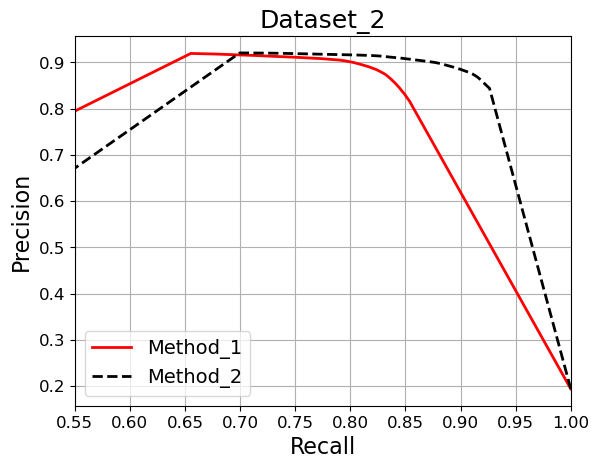
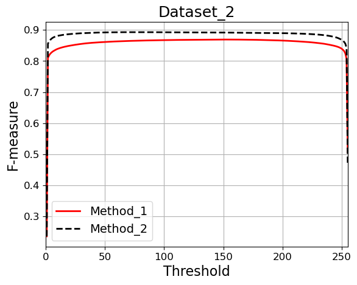

# SOD_Evaluation_Metrics
**A more complete python version (GPU) of the fast evaluation for salient object detection (with S-measure, Fbw measure, MAE, max/mean/adaptive F-measure, max/mean/adaptive E-measure, PRcurve and F-measure curve)**

- A fork from zyjwuyan's repo adding IOU and Relax F-measure
- Reorganize directory per dataset 
- The source files should be orginized as follows:

      --Dataset_1/
		--masks/
		    --img1.png
		    --img2.png
                    ...
		--method1/
		    --img1.png
		    --img2.png
                    ...
      --Dataset_2/
		--masks/
		    --img1.png
		    --img2.png
                    ...
		--method1/
		    --img1.png
		    --img2.png
			    ...
		...

- Evaluate your map by run: 

`python ./src/main.py \
 --pred_root_dir ${dataset_dir} \
 --save_dir ${score_dir} \
 --methods "method1 method2"\
 --datasets "Dataset_1 Dataset_2" \
 --cuda False
`
  
- The format of the result file is shown as [this](./score/result.txt).

  `#[Dataset_Name] [Method_Name]# [value mae], [value max-fmeasure], [value mean-fmeasure], [value9 adp-fmeasure], [value max-Emeasure], [value mean-Emeasure], [value adp-Emeasure], [value S-measure_alpha05], [value Fbw-measure], [value relax-F-meausre], [value mean_IoU].`

- Draw the PR curve and F-measure Curve by run:
  
    `python draw_curve.py`
  
  Then, the image file will be saved to './score/'. Two virtual curves are shown as follows:

| PR curve: Dataset_2  | F-measure curve: Dataset_2 | 
|:--------------------|:----------------
|  |    | 

- The above metrics are related to the following papers:

      @inproceedings{Fmeasure,
          title={Frequency-tuned salient region detection},
          author={Achanta, Radhakrishna and Hemami, Sheila and Estrada, Francisco and S{\"u}sstrunk, Sabine},
          booktitle=CVPR,
          number={CONF},
          pages={1597--1604},
          year={2009}
      }
      
      @inproceedings{MAE,
          title={Saliency filters: Contrast based filtering for salient region detection},
          author={Perazzi, Federico and Kr{\"a}henb{\"u}hl, Philipp and Pritch, Yael and Hornung, Alexander},
          booktitle=CVPR,
          pages={733--740},
          year={2012}
      }
      
      @inproceedings{Smeasure,
          title={Structure-measure: A new way to eval foreground maps},
          author={Fan, Deng-Ping and Cheng, Ming-Ming and Liu, Yun and Li, Tao and Borji, Ali},
          booktitle=ICCV,
          pages={4548--4557},
          year={2017}
      }
      
      @inproceedings{Emeasure,
          title="Enhanced-alignment Measure for Binary Foreground Map Evaluation",
          author="Deng-Ping {Fan} and Cheng {Gong} and Yang {Cao} and Bo {Ren} and Ming-Ming {Cheng} and Ali {Borji}",
          booktitle=IJCAI,
          pages="698--704",
          year={2018}
      }
      
      @inproceedings{wFmeasure,
        title={How to eval foreground maps?},
        author={Margolin, Ran and Zelnik-Manor, Lihi and Tal, Ayellet},
        booktitle=CVPR,
        pages={248--255},
        year={2014}
      }
    @inproceedings{relaxFmeasure,
	title = {BASNet: Boundary-Aware Salient Object Detection},
	author = {Qin, Xuebin and Zhang, Zichen and Huang, Chenyang and Gao, Chao and Dehghan, Masood and Jagersand, Martin},
	booktitle = {The IEEE Conference on Computer Vision and Pattern Recognition (CVPR)},
	month = {June},
	year = {2019}
	}
